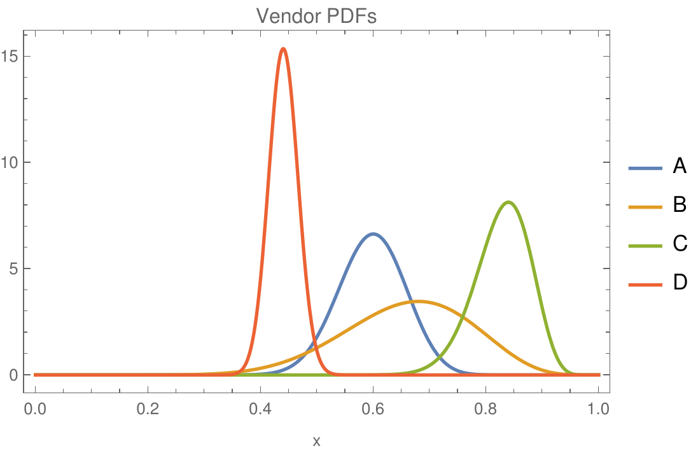

# potest

**"POsiTive Experience Statistical Test": a simple code that, based on input data about vendors and their ratings, recommends which is most likely to result in a positive experience to the client.
Written by Manuel A. Buen-Abad.**

📄 Description
-----------------------------------------

Given user-provided data about vendors, such as their rating and number of reviews, our code computes the probability that each vendor will provide a more positive experience to the user than all the other vendors.

For example, consider 4 vendors rated with the 5-stars system.
Assume the data for these vendors is as follows:
- Vendor A: 3 stars & 65 reviews,
- Vendor B: 3.4 stars & 15 reviews,
- Vendor C: 4.2 stars & 55 reviews, and
- Vendor D: 2.2 stars & 364 reviews.

After running, our code yields

| Vendor | Rating | No. of Reviews | Prob. of Best Exper. |
| -----: | -----: | -------------: | -------------------: |
|      C |    4.2 |             55 |                0.921 |
|      B |    3.4 |             15 |               0.0776 |
|      A |      3 |             65 |              0.00127 |
|      D |    2.2 |            364 |                4e-11 |

The third column is the probability we are interested in.
Clearly C is the best vendor, with a probability of 92.1% of providing the user with a positive experience better than those of vendors B, A, and D.

**NOTE:** We model client experience as a probabilistic beta distribution. For more details, see the section titled _"Mathematical Formulas"_ in this README.

📋 Instructions
-----------------------------------------

In your terminal, run:

`python potest.py`

and follow the instructions that appear in the command-line interface (CLI) to enter the following data:

- the number of vendors you are interested in,
- the rating scale (e.g. enter 5 for ratings based on the 5-star system, or 10 for 10-points),
- the name of the vendor,
- its rating (e.g. 4.5 if the vendor has 4.5 stars)
- its number of reviews.

After this, the code will compute the probability for each vendor to provide an overall experience to the client better than that of all the others.
Finally, the code will print out a table with that information, ranking each vendor from highest to lowest according to this probability.

You can additionally run with the following flags:
- `--help`: help.
- `--method`: integration method (`mc` for (Quasi-)Monte Carlo, or `quad` for quadratures). Default: `quad`.
- `--samples`: number of samples used in the QMC method. Default: $2^{16} = 65536$.
- `--print_error`: boolean flag. Its presence indicates that the error of the integrals should be included in the final result. Default: False.

❓ Requirements
-----------------------------------------

1. python (>= 3.7)
2. pandas (>= 1.0.0)
3. numpy (>= 1.17.0)
4. scipy (>= 1.7.0)

💡 Mathematical Formulas
-----------------------------------------

Let $N$ be the number of vendors.
Let $s$ be the scale of the rating system (the same for all).
Let $i$ be the $i$-th vendor, $r_i$ its rating, and $n_i$ the number of its reviews.
We can then define the probability distribution function (PDF) $f_i(x_i) of a client getting a "positive experience" $x_i$ with vendor $i$.
We understand this experience as the number $x_i \in [0, 1] which would correspond to $r_i^{(u)}/s$, where $r_i^{(u)}$ is the rating the user would give to the vendor after employing its services.
We model $x_i$ as coming from the beta distribution:

$$
X_i \sim \mathrm{Beta}(\alpha_i, \beta_i) \ ,
$$

where

$$
f_i(x_i) = \frac{\Gamma(\alpha_i + \beta_i)}{\Gamma(\alpha_i) \Gamma(\beta_i)} \ x^{\alpha_i - 1} (1 - x)^{\beta_i - 1} \ .
$$

In the above expressions $\Gamma(t)$ is the gamma function, and $\alpha_i \equiv \left( r_i / s \right) n_i + 1$ and $\beta_i \equiv \left( 1 - r_i / s \right) n_i + 1$.
Clearly $\alpha-1$ and $\beta-1$ are the average number of "successes" or "failures" for customer experience.

For the example four vendors listed above, this is what their PDFs look like:

We are interested in the probability that the client will have a positive experience with vendor $i$ that is _better_ than what he would experience with all the _other_ vendors $j \neq i$.
Defining such probability as $p_i$, we can easily see that

$$
p_i \equiv \mathrm{Pr}\left( X_i > \underset{j \neq i}{\max} X_j \right) = \int\limits_{[0, 1]^N} dx^N \ f_i(x_i) \prod\limits_{j \neq i} f_j(x_j) \cdot \Theta(x_i - x_j) \ ,
$$

where $\Theta(t)$ is the Heaviside step function.

With the help of the theta function, some straightforward manipulations show that $p_i$ can be simplified further into two equivalent expressions.
First:

$$
p_i = \mathbb{E}_{X_{\text{--}i}} \left[ S_i \left( \underset{j \neq i}{\max} X_j \right) \right] = \int\limits_{[0, 1]^{N-1}} dx_{\text{--}i}\ \prod\limits_{j \neq i} f_j(x_j) \ S_i \left( \underset{j \neq i}{\max} x_j \right) \ ,
$$

where $\text{--}i$ means all non-$i$ vendors, and $S(t) = 1 - F(t)$ is the survival function (SF, a.k.a. tail function), with $F(t) = \int\limits_0^t d\tau \ f(\tau)$ being the cumulative density function (CDF).

Collapsing the theta function over the $x_j$ instead yields a simpler 1-D expression:

$$
p_i = \mathbb{E}_{X_i} \left[ \prod\limits_{j \neq i} F_j(X_i) \right] = \int\limits_0^1 d x \ f_i(x) \ \prod\limits_{j \neq i} F_j(x) \ .
$$

In our code, we use the last expression. Our two methods, Quasi-Monte Carlo (QMC) and quadratures, simply compute this integral numerically.
For our QMC method, we use the "inverse transform sampling" approach.

Indeed, let $U_i \equiv F_i(X_i)$.
Since $F_i$ is the CDF of $X_i$, $U_i \sim \mathrm{Uniform}(0, 1)$.
This means that $X_i = F_i^{-1}(U_i)$ has PDF $f_i$; $F^{-1}$ is the probability point function (PPF), the inverse of the CDF.
With $x = F^{-1}_i(u)$, the change of variables $x \to u$ gives the Jacobian

$$
\frac{dx}{du} = \frac{1}{F_i\prime(x)} = \frac{1}{f_i(x)} \ , \quad \Rightarrow \quad f_i(x) dx = du \ .
$$

Thus, we find a third equivalent formula:

$$
p_i = \int\limits_0^1 d u \ \prod\limits_{j \neq i} F_j(F_i^{-1}(u)) \ .
$$

We can use this to construct the numerical estimator used in our QMC method:

$$
\hat{p}_i = \frac{1}{\mathcal{N}} \sum\limits_{k=1}^{\mathcal{N}} \prod\limits_{j \neq i} F_j(F_i^{-1}(u^{(k)})) \ .
$$

In a Monte-Carlo method, the $u^{(k)}$ are $\mathcal{N}$ iid draws from $\mathrm{Uniform}(0, 1)$.
In our QMC method, we use a Sobol sequence, which is deterministic and low-discrepancy.
The advantage of using a QMC method over a pure MC is that the integration error is much smaller for the same number of samples (for moderate dimensions and smoothness).